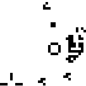

# Game of Life



Small project to teach myself Java ~2006.

Game of life rules:
1. Any live cell with fewer than two neighbours dies, as if by loneliness.
2. Any live cell with more than three neighbours dies, as if by overcrowding.
3. Any live cell with two or three neighbours lives, unchanged, to the next
   generation.
4. Any dead cell with exactly three neighbours comes to life.

## Versions

Four versions, adding features as I progressed:
* GOLApplet: Initial version, implements the classic Game of Life
* GOLApplet2: Includes "diff" display between rounds. Red indicates cell death, green indicates cell growth.
* GOLApplet3: Buttons to start and stop the game, clear and randomise the board.
* GOLApplet4: Diff button to toggle diff display and you can draw when the game is stopped.

## Compilation

```
javac GOLApplet.java
javac GOLApplet2.java
javac GOLApplet3.java
javac GOLApplet4.java
```

HTML files are included that can embed the applets.
